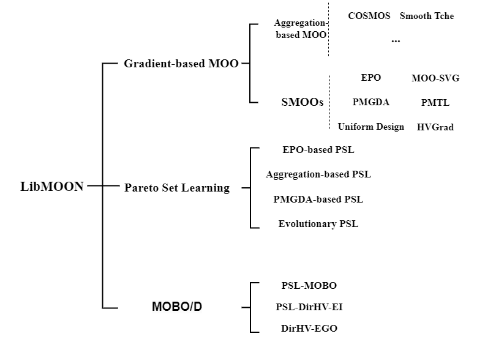
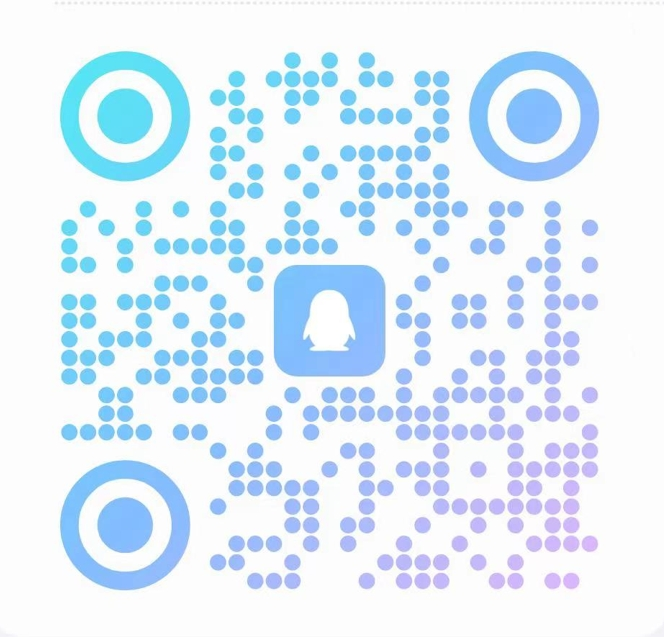

# LibMOON: A Gradient-based MultiObjective OptimizatioN Library in PyTorch


[](https://libmoondocs.readthedocs.io/en/latest/)
[](https://github.com/xzhang2523/libmoon/blob/main/LICENSE)
[](https://badge.fury.io/py/LibMOON)
[](https://github.com/xzhang2523/libmoon)
[](https://hits.seeyoufarm.com)
[](https://github.com/xzhang2523/libmoon) 

``LibMoon`` is an open-source library built on [PyTorch](https://pytorch.org/) for gradient-based MultiObjective (MOO). See the [latest documentation](https://libmoon.readthedocs.io/en/latest/) for detailed introductions and API instructions.

Star and fork us on GitHub — it motivates us a lot!

# News
- **[Aug 27 2024]** Added support for [LoRA-PSL](https://arxiv.org/pdf/2407.20734) (ICML 2024). Many thanks to [Weiyu Chen](https://scholar.google.com/citations?user=Zbg7LycAAAAJ&hl=zh-CN) for his contribution.


- **[July 20 2024]** Supports most popular gradient-based methods: mgdaub random epo pmgda agg_ls agg_tche agg_mtche agg_pbi agg_cosmos agg_softtche pmtl hvgrad moosvgd.

- **[April 20 2024]** Supports [PMTL](https://arxiv.org/abs/1912.12854), [HvGrad](https://arxiv.org/abs/2102.04523). Many thanks for Dr [Xi Lin's](https://scholar.google.com/citations?user=QB_MUboAAAAJ&hl=en) contribution. Thanks for previous helpful communications from Dr [Hao Wang](https://scholar.google.com/citations?user=Pz9c6XwAAAAJ&hl=en).  


# 1. Supported Problems
## Synthetic Problems

Here's a list of synthetic problems along with relevant research papers and project/code links:

| Problem | Paper                                                                | Project/Code                                         |
|---------|----------------------------------------------------------------------|------------------------------------------------------|
| ZDT     | [Paper](https://ieeexplore.ieee.org/document/996017)                 | [Project](https://pymoo.org/problems/multi/zdt.html) |
| DTLZ    | [Paper](https://ieeexplore.ieee.org/document/996017)                 | [Project](https://pymoo.org/problems/many/dtlz.html) |
| MAF     | [Paper](https://link.springer.com/article/10.1007/s40747-017-0039-7) | [Project](https://pymoo.org/problems/multi/maf.html) |
| WFG     | [Paper](https://ieeexplore.ieee.org/document/996017)                 | [Code](https://github.com/sample-repo/wfg-code)      |
| Fi's    | [Paper](https://ieeexplore.ieee.org/document/996017)                 | [Code](https://github.com/sample-repo/fis-code)      |
| RE      | [Paper](https://arxiv.org/abs/2009.12867)                            | [Code](https://github.com/ryojitanabe/reproblems)    |

### Multitask Learning Problems

This section details problems related to multitask learning, along with their corresponding papers and project/code
references:

| Problem                     | Paper                                                                                                                | Project/Code                                           |
|-----------------------------|----------------------------------------------------------------------------------------------------------------------|--------------------------------------------------------|
| MO-MNISTs                   | [PMTL](https://proceedings.neurips.cc/paper_files/paper/2019/file/685bfde03eb646c27ed565881917c71c-Paper.pdf)        | [COSMOS](https://github.com/ruchtem/cosmos)            |
| Fairness Classification     | [COSMOS](https://arxiv.org/pdf/2103.13392.pdf)                                                                       | [COSMOS](https://github.com/ruchtem/cosmos)            |
| MORL problems (DST, FTS...) | [Envelop](https://proceedings.neurips.cc/paper_files/paper/2019/file/4a46fbfca3f1465a27b210f4bdfe6ab3-Paper.pdf)     | [Project](https://github.com/sample-repo/envelop-code) |


## Supported Solvers

LibMOON includes a variety of solvers tailored for different needs as img below shows. The following solvers are
currently:

</img>

## Gradient-based MOO Solver
  - GradAggSolver
  - EPOSolver
  - MOO-SVGDSolver (*)
  - MGDASolver
  - PMGDASolver
  - PMTLSolver
  - HVGradSolver

(*) The original MOO-SVGD code does not include an implementation for Multitask Learning (MTL). Our release of MOO-SVGD
is the first open-source code that supports MTL.

| Method  | Property  | Paper|
|--------------------------------|---------------------------------|------------------------------------------------------------------------------------------------------|
| EPO (Mahapatra et al 2020)     | Exact solutions                 | [paper](https://proceedings.mlr.press/v119/mahapatra20a.html)                                        |
| MGDA-UB (Sener et al 2018)     | Arbitrary solutions             | [paper](https://arxiv.org/abs/1810.04650)                                                            |
| PMGDA (Zhang et al 2024)       | Specific solutions              | [paper](https://arxiv.org/abs/2402.09492)                                                            |
| Random (Lin et al 2021)        | Arbitrary solutions             | [paper](https://arxiv.org/abs/2111.10603)                                                            |
| MOO-SVGD (Liu et al 2021)      | Diverse solutions               | [paper](https://papers.nips.cc/paper_files/paper/2021/hash/7bb16972da003e87724f048d76b7e0e1-Abstract.html) |
| PMTL (Lin et al 2019)          | Sector solutions                | [paper](https://arxiv.org/abs/1912.12854)                                                            |
| HVGrad (Deist et al 2021)      | Maximal HV solutions            | [paper](https://arxiv.org/abs/2102.04523)                                                            |
| Agg-LS (Miettinen et al 1999)  | Convex hull solutions           | [book](https://link.springer.com/book/10.1007/978-1-4615-5563-6)                                     |
| Agg-Tche (Zhang et al 2007)    | Exact solutions                 | [paper](https://ieeexplore.ieee.org/document/4358754)                                                |
| Agg-mTche (Ma et al 2017)      | Exact solutions                 | [paper](https://ieeexplore.ieee.org/document/7927726)                                                |
| Agg-PBI (Zhang et al 2007)     | Approximate exact solutions     | [paper](https://ieeexplore.ieee.org/document/4358754)                                                |
| Agg-COSMOS (Ruchte et al 2007) | Approximate exact solutions     | [paper](https://arxiv.org/abs/2103.13392)                                                            |
| Agg-SoftTche (Lin et al 2024)  | Fast approximate exact solutions | [paper](https://arxiv.org/abs/2402.19078)                                                                                            |

Notations:
- $m$ is the number of objectives.
- $K$ is the number of subproblems.
- $n$ is the number of decision variables.

For neural network based methods, $n$ is the number of parameters; hence $n$ is very large (>10000), $K$ is also large (
e.g., 20-50), while $m$ is small (2.g., 2-4).
As a result, $m^2$ is not a big problem. $n^2$ is a big problem. $K^2$ is a big problem.

Time complexity of gradient based methods are as follows,

1. Tier 1. GradAggSolver.
2. Tier 2. MGDASolver, EPOSolver, PMTLSolver.
3. Tier 3. GradHVSolver
4. Tier 4. MOOSVGDSolver

Important things to notice:
The original code MOO-SVGD does not offer a MTL implement. Our code is the first open source code for MTL MOO-SVGD.

## Pareto set learning(PSL) Solvers

LibMOON supports various models of PSL solvers, categorized as follows:

| Method| Property | Paper                                                                      |
|-----|------|----------------------------------------------------------------------------|
| EPO-based PSL (Navon et al 2021) | Exact solutions  | [paper](https://openreview.net/pdf/9c01e8c47f7e80e87af0175ac2a5e9a356f518bd.pdf) |
| PMGDA-based PSL (Zhang et al 2024) | Specific solutions| [paper](https://arxiv.org/abs/2402.09492)                                  |
| Aggregation-baed PSL (Sener et al 2018) | Minimal aggregation function solutions | [paper](https://openreview.net/pdf/9c01e8c47f7e80e87af0175ac2a5e9a356f518bd.pdf) |
| Evolutionary PSL (Sener et al 2018) | Mitigate local minimal by ES | [paper](https://arxiv.org/pdf/2310.20426)                                                                  |
| LoRA PSL (Chen et al 2024)     | Arbitrary solutions | [paper](https://openreview.net/pdf?id=a2uFstsHPb)|


## MultiObjective Bayesian Optimization (MOBO) Solvers

- PSL-MONO
- PSL-DirHV-EI
- DirHV-EGO

## Installation

Libmoon is available on PyPI. You can install it using pip:

```bash
pip install libmoon==0.1.11
```

- **Example1**: Finding a size-K (K=5) Pareto solutions with four lines of code.

```python
from libmoon.solver.gradient.methods import EPOSolver
from libmoon.util.initialization import synthetic_init
from libmoon.util.weight_factor import uniform_pref
from libmoon.util import get_problem

problem = get_problem(problem_name='ZDT1')
prefs = uniform_pref(n_prob=5, n_obj=problem.n_obj, clip_eps=1e-2)
solver = EPOSolver(problem, step_size=1e-2, n_iter=1000, tol=1e-2)
res = solver.solve(x=synthetic_init(problem, prefs), prefs=prefs)
```

- **Example2**: PSL in a problem with three lines of solving problem and two lines of
  evaluating the results.

```python
from libmoon.solver.psl.core_psl import AggPSLSolver
from libmoon.util import get_problem
from libmoon.util.weight_factor import uniform_pref
from torch import Tensor

problem = get_problem(problem_name='ZDT1')
# agg list [ ’ls ’, ’tche ’, ’mtche ’, ’pbi ’, ... ]
prefs = uniform_pref(n_prob=100, n_obj=problem.n_obj, clip_eps=1e-2)
solver = AggPSLSolver(problem, agg='ls')
model = solver.solve()
eval_y = problem.evaluate(model(Tensor(prefs).cuda()))

```

If you find our code useful, please cite our paper:

```bibtex
@software{libmoon_2024,
  author = {Zhang, Xiaoyuan and Zhao, Liang and Yu, Yingying and Lin, Xi and Chen, Yifan and Zhao, Han and Zhang, Qingfu},
  title = {{LibMOON: A Gradient-based MultiObjective
OptimizatioN Library in PyTorch}},
  url = {https://github.com/xzhang2523/libmoon},
  version = {2.0.4},
  year = {2024}
}
```

## Main Contributors
The first three authors contribute equally to this work.

| **Name**           | **Institution** | **Role**                                                    |
|--------------------|-----------------|-------------------------------------------------------------|
| **Xiaoyuan Zhang** | CityUHK         | Pareto set learning/Discrete solutions solvers/Project lead |
| **Liang Zhao**     | CityUHK         | MOBO                                                        |
| **Yingying Yu**    | CityUHK         | Software design                                             |
| **Xi Lin**         | CityUHK         | Software design                                             |


We sincernely thank the following contributors for their valuable contributions or feedbacks:
## Advisory Board
| **Name**               | **Institution**            | **Role**                                            |
|------------------------|----------------------------|-----------------------------------------------------|
| **Xuehai Pan**         | PKU                        | For software design                                 |
| **Hongzong Li**        | CityUHK                    | For local search                                    |
| **Zhe Zhao**           | CityUHK/USTC               | MODL                                                |
| **Meitong Liu**        | HKU| Feedback                                            |
| **Weiduo Liao**        | CityUHK/SusTech            | HV-Net/Paper writing                                |
| **Weiyu Chen**         | HKUST| For LoRA PSL                                        |
| **Prof. Jingda Deng**  | Xi'an Jiaotong University  | For advice on High-D hypervolume computation        |
| **Prof. Yifan Chen**   | Hong Kong Baptist University | For advice on OR                                    |
| **Prof. Ke Shang**     | Shenzhen University        | For advice on approximate hypervolume-based methods |
| **Prof. Genghui Li**   | Shenzhen University        | For advice on MOEAs                                 |
| **Prof. Han Zhao**     | University of Illinois at Urbana-Champaign | For advice on fairness classification               |
| **Prof. Zhenkun Wang** | SusTech                    | Paper writing and maintenance of community          |
| **Prof. Tao Qin**      | MSRA                       | Industry application                                |
| **Prof. Qingfu Zhang** | CityUHK                    | Corresponding author                                |

## Contact
- Xiaoyuan Zhang [xzhang2523-c@my.cityu.edu.hk]
- QQ group:

 <p align="center">
  
</p>

- Wechat group:
<p align="center">
  
</p>

- Slack group: https://cityu-hiv5987.slack.com/archives/C07GU3N2H2S

## Star History

[](https://star-history.com/#xzhang2523/libmoon&Date)


